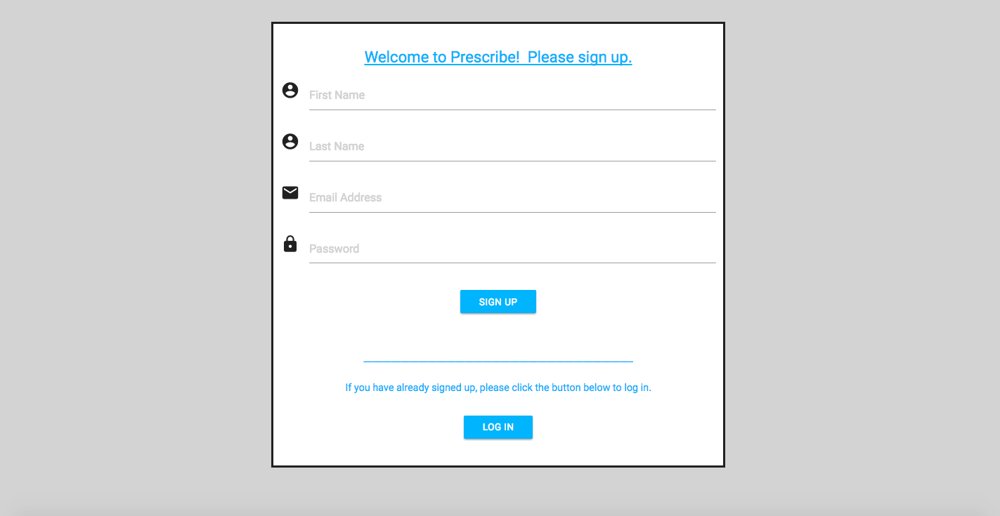
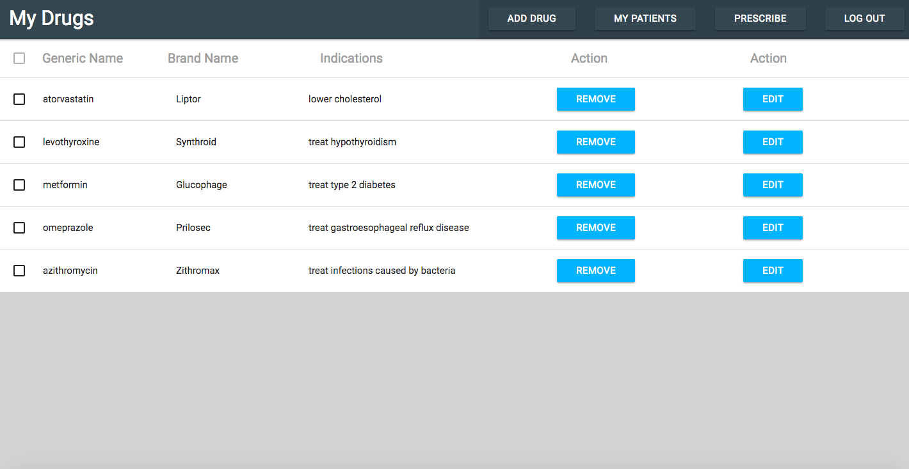
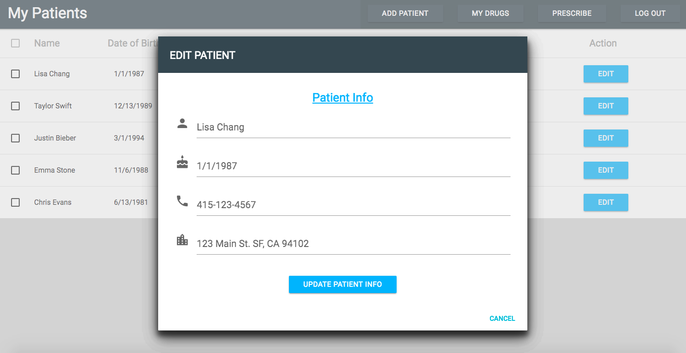

# Prescribe (Capstone Project)
Nov 2017 – Dec 2017

**Summary:**

This application is designed for prescribers to prescribe medications by selecting the desired medications and patients from the drug and patient list and electronically send the prescription to the pharmacy.

It supports 4 CRUD operations which allows prescribers to create, remove, update, or delete drugs/patients from the drug/patient list.

**Technologies:**

Frontend: JavaScript ES6, HTML, Materialize CSS, Material UI, JSX, Storybook, React, Redux, React Router

Backend: PostgreSQL, Python, Flask, RESTful API, bCrypt, JWT, Psycopg2
Testing and Other: Super Test, Jest, Enzyme, Postman

**The following are some of the pages in the app:**

## The sign-up page

This page allows the doctor to create an account.  All fields have to be filled in and validation checks are performed.  Correct email address format and passwords which are at least 8 characters long are required for successful registration.

## The drug page

This page allows signed-in doctors to see their drugs and performed CRUD (create, retrieve, update, delete) operations.

I rebuilt fully functional REST API using Python and Flask (self-taught) for my backend.  Psycopg2 adapter was used to connect Python to PostgreSQL database server.

## The add-drug dialog

Pop-up windows appear when doctors click the add, remove and edit buttons on the drug page.  This image shows the add-drug window.

## The edit-patient dialog

Pop-up windows appear when doctors click the add, remove and edit buttons on the patient page as well.  This image shows the edit-patient window.

## The prescribe page

The prescribe form is auto-complete which expedites the prescribing process.

Drop down menus appear when doctors type in just one letter in the form.

Prescribers can order medications for patients at the click of a button to avoid the hassle of handwritten scripts.

