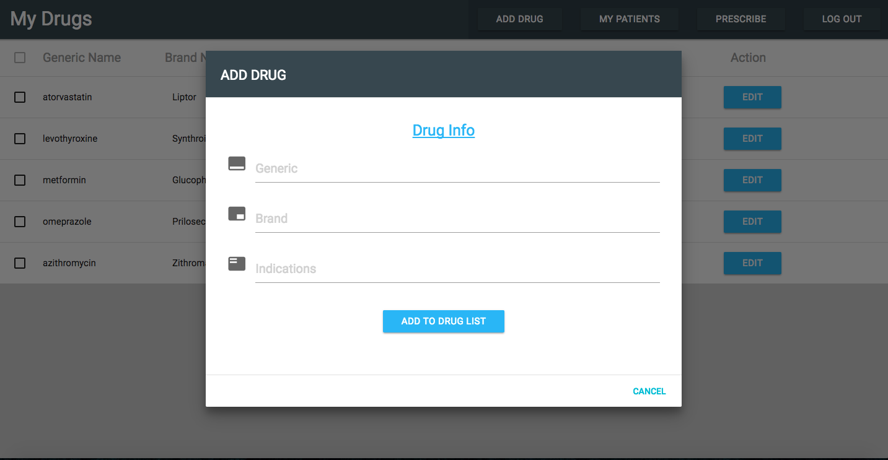
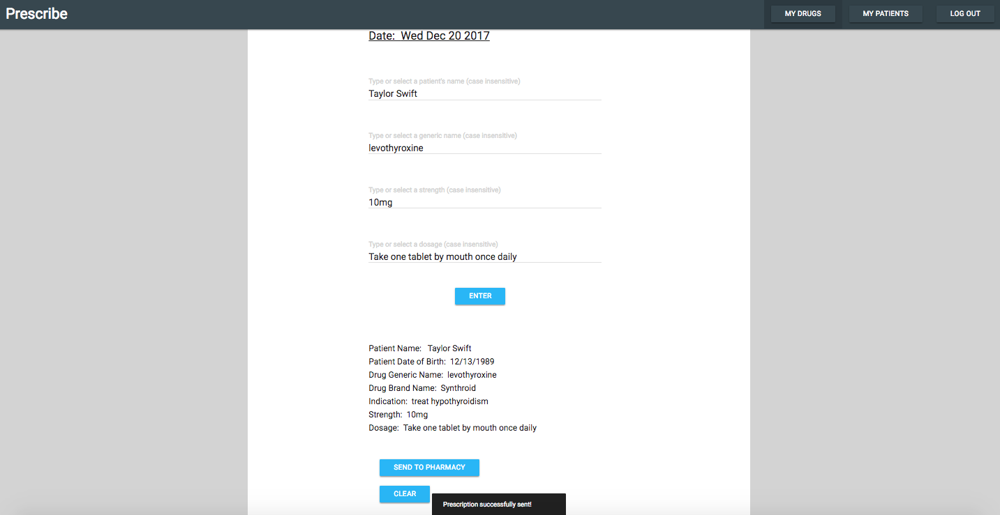

This page allows signed-in doctors to see their drugs and performed CRUD (create, retrieve, update, delete) operations.

Pop-up windows appear when doctors click the add, remove and edit buttons.

The prescribe form is auto-complete which expedites the prescribing process.

Drop down menus appear when doctors type in just one letter in the form.

Prescribers can order medications for patients at the click of a button to avoid the
hassle of handwritten scripts.

Prescribe (Capstone Project)
Nov 2017 – Dec 2017

Summary:

This application is designed for prescribers to prescribe medications by selecting the desired medications and patients from the drug and patient list and electronically send the prescription to the pharmacy.

It supports 4 CRUD operations which allows prescribers to create, remove, update, or delete drugs/patients from the drug/patient list.

Technologies:

Frontend: JavaScript ES6, HTML, Materialize CSS, Material UI, JSX, Storybook, React, Redux, React Router

Backend: PostgreSQL, Python, Flask, RESTful API, bCrypt, JWT, Psycopg2
Testing and Other: Super Test, Jest, Enzyme, Postman
