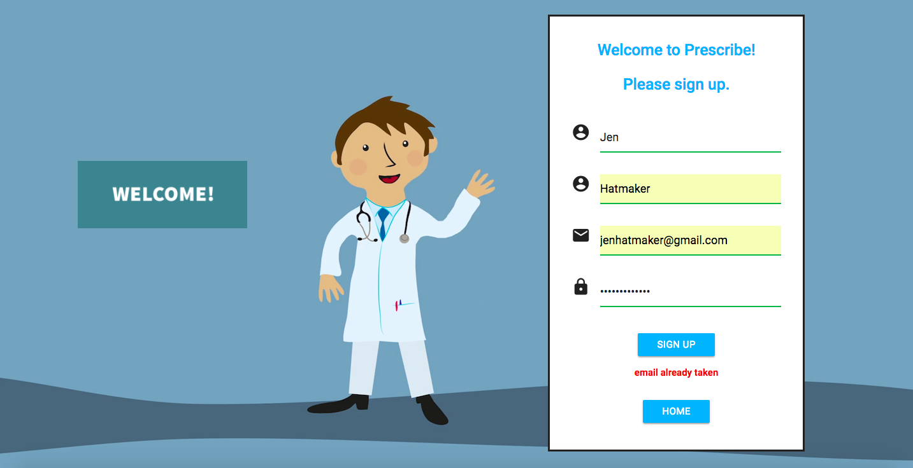
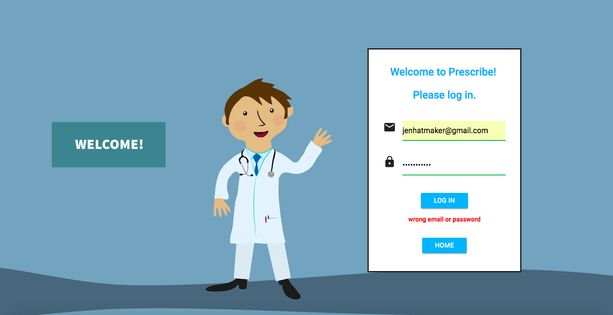

# Prescribe (Capstone Project)
Created: Nov 2017 – Dec 2017
Updated: April 2018

**Summary:**

This application is designed for prescribers to prescribe medications by selecting the desired medications and patients from the drug and patient list and electronically send the prescription to the pharmacy.

It supports 4 CRUD operations which allows prescribers to create, remove, update, or delete drugs/patients from the drug/patient list.

**Technologies:**

Frontend: JavaScript ES6, HTML, Materialize CSS, Material UI, JSX, Storybook, React, Redux, React Router

Backend: PostgreSQL, Python, Flask, RESTful API, bCrypt, JWT, Psycopg2

Testing and Other: Super Test, Jest, Enzyme, Postman

## The Home Page

Dr. John Smith introduced and described the major functionality of the app.

## The Sign Up Page

This page allows the doctor to create an account.  

All fields have to be filled in and validation checks are performed.  

Correct email address format and passwords which are at least 8 characters long are required for successful registration.

An error message will appear if the entered email address is already in the system.

## The Log In Page

This page allows the doctor to log in.  

All fields have to be filled in and validation checks are performed.  

Input validation checks are performed again for correct email address format and password length.

An error message will appear if incorrect email addresses or passwords were entered.

## CRUD operations on Two Large Databases

Both the drug and the patient page allow signed-in doctors to see their drugs/patients and perform CRUD (create, retrieve, update, delete) operations.

I rebuilt fully functional REST API using Python and Flask (self-taught) for my backend.  

Psycopg2 adapter was used to connect Python to PostgreSQL database server.

**Top of the Drug Page**

**Bottom of the Drug Page**

**Top of the Patient Page**

**Bottom of the Patient Page**

## Dialogs

Pop-up windows appear when doctors click the add, edit or remove button on the drug and the patient page.

Below are the dialogs on the drug page.

**Add Drug**

**Edit Drug**

**Remove Drug**

## The Prescribe Page

The prescribe form is auto-complete which expedites the prescribing process.

Drop down menus appear when doctors type in just one letter in the form.

Prescribers can order medications for patients with the click of a button to avoid the hassle of handwritten scripts.

A success message is toasted when the prescription is sent to the pharmacy.

**Top of the Prescribe Page**

**Bottom of the Prescribe Page**

**Prescription Successfully Sent!!**

